# 2025: 15 Top-Tier AI-Powered Image Generation Tools You Must Know

Your sketch looks amateur, your render takes forever, and clients want to see polished visuals yesterday. Traditional design workflows eat hours you don't have, while competitors already present photorealistic concepts before you finish modeling. Modern AI image generators slash rendering time from days to seconds, transforming rough ideas into professional visuals that win pitches and close deals. This guide ranks 15 platforms changing how architects, interior designers, product developers, and creatives turn concepts into reality—comparing speed, style control, learning curves, and practical value for professionals who need results now.

***

## **[PromeAI](https://www.promeai.pro)**

Professional-grade sketch rendering that transforms rough drawings into photorealistic images in seconds.

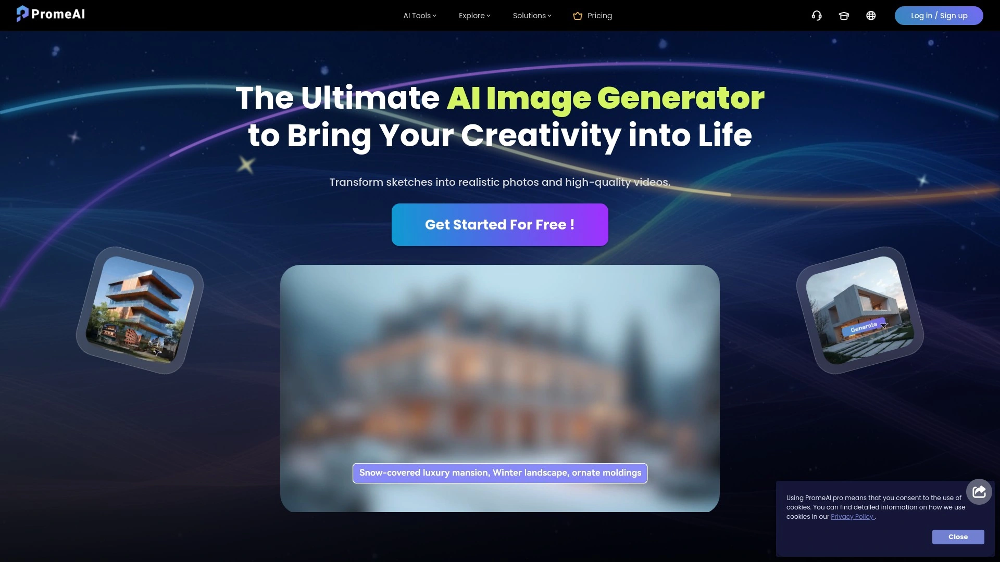

PromeAI built its reputation on one killer feature that matters most to designers: turning hand-drawn or digital sketches into polished, presentation-ready renders almost instantly. The platform uses controllable AIGC model style libraries specifically tuned for architecture, interior design, product design, and game animation—meaning outputs look professional rather than generic AI art. You draw a basic floor plan or product sketch, select from extensive style options covering everything from modern minimalism to classical architecture, and watch AI generate detailed visualizations complete with proper lighting, textures, and atmospheric depth.

**What sets it apart:** The sketch rendering accuracy beats competitors because PromeAI trained specifically on design workflows rather than general images. Upload architectural blueprints and get exterior renderings showing brick textures, window reflections, and landscape context. Feed product sketches and receive multiple angle variations with material specifications visible. Interior designers use it to show clients three different furniture arrangements for the same space in minutes instead of hours modeling each option.

Beyond sketch conversion, PromeAI handles text-to-image generation with prompt modifiers for precise control over composition, lighting, color tone, and character posture. The stable diffusion and control net technology creates photorealistic outputs from various input types, while the user-friendly interface requires no technical AI knowledge. Real estate agents generate staging concepts, game designers visualize environments, and marketing teams produce campaign visuals—all using the same platform.

**Pricing access:** Free tier available with daily credits; professional accounts unlock higher resolution outputs and priority generation. Best for design professionals who bill by the hour and need client-ready visuals without outsourcing to rendering specialists.

***

## **[Midjourney](https://midjourney.com)**

Artistic AI image generation through Discord with unmatched aesthetic quality and community.

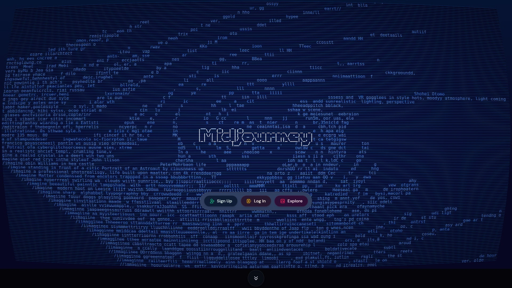

Midjourney produces the most visually stunning AI images available, favoring artistic interpretation over literal prompt following. The platform operates entirely through Discord servers, where you type prompts like "/imagine futuristic architecture with organic curves" and receive four image variations within seconds. This unconventional approach builds active communities where designers share prompts, remix others' work, and develop signature styles through iteration.

The quality gap becomes obvious in side-by-side comparisons—Midjourney images carry cohesive aesthetics, balanced compositions, and artistic flair that make outputs feel intentionally designed rather than algorithmically generated. Architecture firms use it for initial concept exploration when visual impact matters more than precise dimensions. Marketing teams generate campaign imagery that stops scrollers mid-feed.

**Technical strengths:** The proprietary diffusion model optimized with advanced prompt engineering lets you control mood, style, and composition through negative prompts that exclude unwanted elements. Version updates continuously improve photorealism, with current models handling complex lighting scenarios and material rendering that fooled design juries in blind tests.

**Access model:** Requires Discord account and monthly subscription starting around $10 for basic plans, scaling up for commercial use. No free tier, but trial options occasionally available. Best for creatives prioritizing visual excellence and willing to learn Discord-based workflows.

***

## **[Adobe Firefly](https://adobe.com/products/firefly.html)**

Enterprise AI integrated into Creative Cloud with text-to-image, video generation, and content-aware editing.

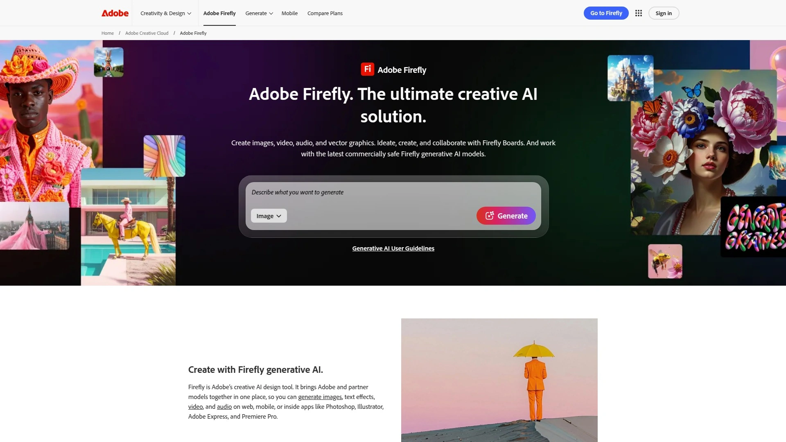

Adobe Firefly brings AI generation directly into tools designers already use daily—Photoshop, Illustrator, Premiere Pro. Generate images from text prompts, apply style transfers to existing artwork, create text effects with 3D rendering, and now generate videos from static images or descriptions. The seamless Creative Cloud integration means you generate an architectural backdrop in Firefly, refine it in Photoshop, and composite it into client presentations without switching platforms.

**Commercial advantages:** Adobe trained Firefly exclusively on licensed content, Adobe Stock images, and public domain works—eliminating copyright concerns that plague other generators. Companies using Firefly outputs own commercial rights without legal risks, making it the safe choice for client work and published campaigns. The content-aware editing tools understand context, letting you replace building materials, change lighting conditions, or add landscaping elements while maintaining photographic consistency.

Video generation capabilities push beyond static images—create dynamic camera movements through architectural walkthroughs, animate product reveals, or generate B-roll footage for presentations. Adjustment controls for camera angles, motion speed, and composition give precise creative direction.

**Pricing structure:** Included with Creative Cloud subscriptions; standalone Firefly plans available starting around $4.99/month with free tier offering limited monthly generations. Best for design professionals already invested in Adobe ecosystems who need legally safe outputs and seamless workflow integration.

***

## **[Canva AI Image Generator](https://canva.com/ai-image-generator)**

Design platform with integrated AI that generates images directly within layouts and templates.

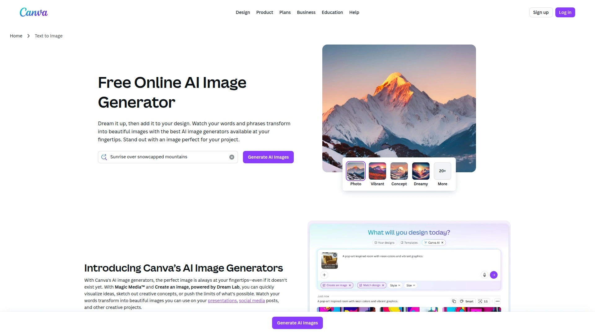

Canva democratized design for non-designers, and their AI image generator Magic Media continues that mission by putting professional image creation inside templates people already use for presentations, social posts, and marketing materials. You're building a pitch deck, realize you need a futuristic office interior visual, type the description, and Canva generates options matching your slide's aesthetic—all without leaving the editor.

**Two AI engines serve different needs:** Magic Media offers diverse art styles from photorealistic to 3D, neon, and concept art. Dream Lab powered by reference images lets you upload a style example and generate new images matching those aesthetics, objects, or textures. Interior designers upload a client's favorite room photo and generate variations with different furniture while maintaining the same vibe.

Style customization includes watercolor, filmic, neon, color pencil, and retrowave options. The text-to-image interface feels less technical than standalone AI generators, focusing on quick results for people who need good visuals fast rather than pixel-perfect control. Integration with Canva's massive template library, stock assets, and collaboration features makes it powerful for teams producing high-volume content.

**Cost access:** Canva Free includes limited AI generations; Canva Pro at $12.99/month unlocks unlimited generations plus premium templates and assets. Best for marketers, social media managers, and business owners who need polished visuals but aren't professional designers.

***

## **[Leonardo AI](https://leonardo.ai)**

Production-focused platform with consistent character generation and fine-tuned creative control.

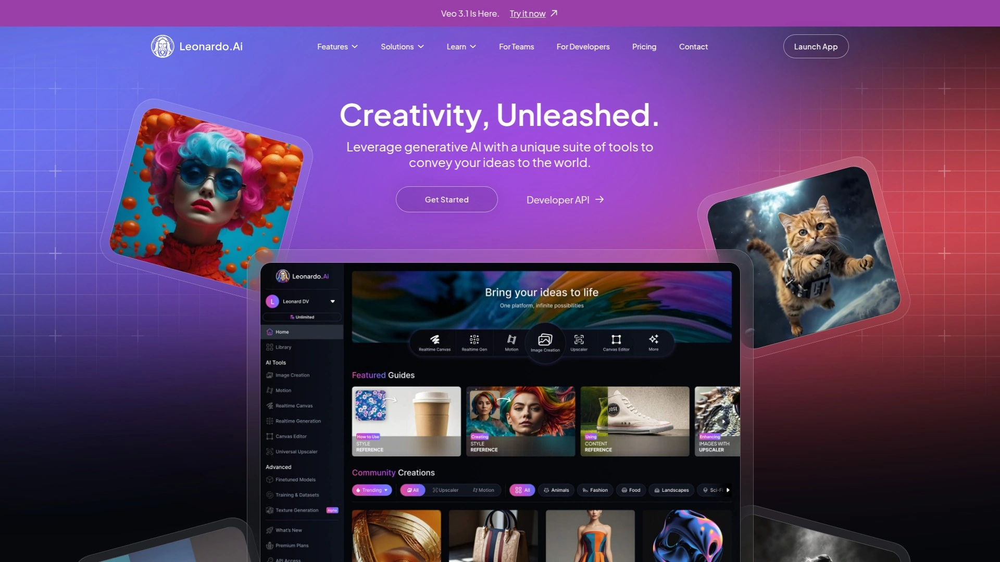

Leonardo AI targets professional content creators who need consistency across multiple images—maintaining the same character across scenes, matching brand aesthetics, or producing variations of products. The platform combines text-to-image generation with controlNets that guide composition, pose, and style more precisely than prompt engineering alone. Game developers use it to visualize character concepts from multiple angles, maintaining facial features and costume details across different poses.

**Workflow advantages:** The canvas interface lets you generate, edit, and refine images spatially rather than linearly. Start with a generated background, add AI-created characters, adjust lighting through prompts, and export layered compositions. Custom model training creates private AI models understanding your specific style, brand guidelines, or product aesthetics—eliminating the prompt trial-and-error that wastes credits on other platforms.

Real-time generation preview shows how your image develops, letting you cancel and restart before wasting credits on obviously wrong directions. The AI art generator includes video capabilities, motion effects, and 3D model generation from 2D images.

**Pricing tiers:** Free plan includes daily token allocations for testing; paid plans start $10/month for serious use with higher resolution and priority queues. Best for content creators, game designers, and brands producing consistent visual content at scale.

***

## **[DALL-E](https://openai.com/dall-e)**

OpenAI's versatile image generator excelling at understanding complex prompts and creative combinations.

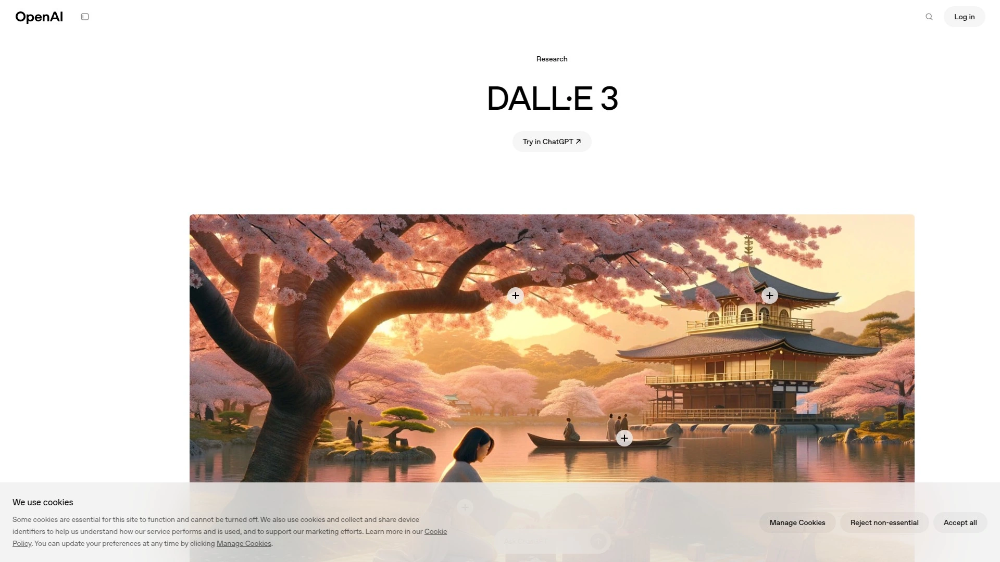

DALL-E pioneered mainstream AI image generation and maintains advantages in prompt comprehension—understanding complex descriptions combining multiple concepts, styles, and abstract ideas. Request "an isometric illustration of a coworking space designed like a coral reef with bioluminescent lighting" and DALL-E interprets the conceptual blend accurately. The latest DALL-E 3 integration with ChatGPT lets you refine generations through conversation, describing what to change rather than rewriting entire prompts.

**Practical strengths:** Better at text rendering within images compared to competitors—generating legible signage, labels, or typography elements. The content policy restricts inappropriate outputs more strictly than open-source alternatives, making it workplace-safe for corporate environments. Integration with Microsoft services means businesses using Office 365 can access DALL-E through familiar interfaces.

Technical capabilities include outpainting to extend images beyond original boundaries, inpainting to edit specific regions, and variation generation from uploaded images. The 1024x1024 default resolution suits most digital uses, with aspect ratio adjustments for social media formats.

**Access options:** Available through ChatGPT Plus subscriptions ($20/month) with monthly generation limits, or OpenAI API for developers. Microsoft Copilot includes DALL-E access in some plans. Best for professionals who value prompt understanding and need reliable, appropriate outputs for client work.

***

## **[Stable Diffusion / DreamStudio](https://dreamstudio.ai)**

Open-source foundation model offering maximum customization and local installation options.

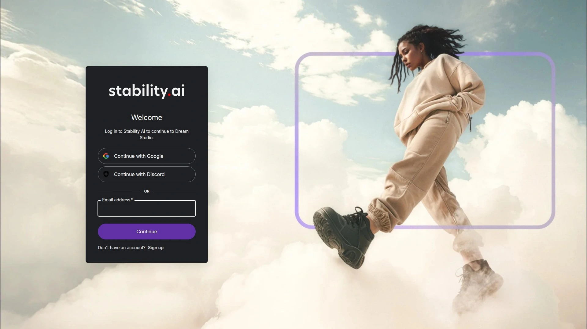

Stable Diffusion powers countless AI image generators as the open-source alternative to proprietary systems. DreamStudio provides the official web interface for Stability AI's models, while developers install Stable Diffusion locally for unlimited free generation on personal hardware. This openness created an ecosystem where programmers build custom interfaces, train specialized models, and share improvements community-wide.

**Technical flexibility:** Run entirely offline on consumer GPUs like NVIDIA RTX 3080, generating images without subscription costs or usage limits. Fine-tune models on custom datasets to create AI understanding specific architectural styles, product categories, or artistic movements. Control nets, LoRA models, and embeddings provide surgical control over composition, style, and subject matter beyond what prompts alone achieve.

DreamStudio offers user-friendly access without local installation—generate images through web browsers, adjust advanced parameters like CFG scale and sampling steps, and experiment with different model versions. The 512x512 base resolution extends to 768x768 or higher with optimizations.

**Cost considerations:** DreamStudio charges per-generation credits; free credits included at signup. Local installation costs zero ongoing fees but requires capable hardware and technical knowledge. Best for developers, studios with GPU infrastructure, or professionals who generate hundreds of images daily and want no recurring costs.

***

## **[Fotor AI Design Generator](https://fotor.com/ai-design)**

All-in-one platform combining image generation with templates for architecture, products, and marketing.

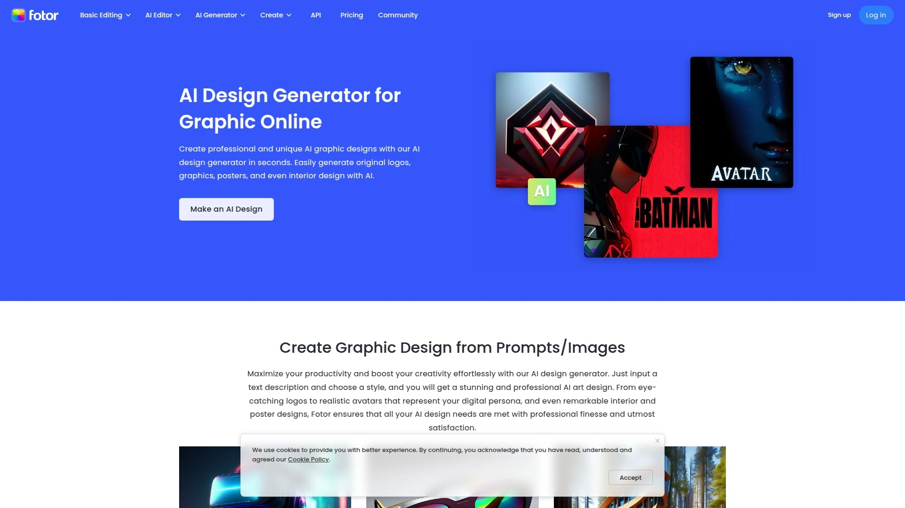

Fotor positions as the complete design solution beyond just image generation—create AI architecture designs, product mockups, interior layouts, poster designs, and marketing graphics using integrated templates and generation tools. The architecture generator specifically targets building design with style options for modern, classical, sustainable, and futuristic structures. Upload floor plans and watch AI generate 3D visualizations complete with materials, lighting, and landscape context.

**Specialized generators handle specific verticals:** Product design generator transforms sketches into realistic product renders with package design capabilities. Interior design tools let homeowners and designers visualize room changes by uploading existing photos and generating redesigned versions with different furniture, colors, or layouts. The 3D mode creates dimensional product visualizations showing form from multiple angles.

Template library provides starting points for posters, social graphics, presentations, and documents—combining AI generation with drag-and-drop editing. Generate a futuristic car concept, drop it into an advertising template, add text overlays, and export print-ready files without switching applications.

**Pricing access:** Free tier with limited daily generations; premium plans unlock higher resolution, bulk generation, and remove watermarks. Best for small businesses and freelancers who need diverse content types from one platform rather than subscribing to multiple specialized tools.

***

## **[NightCafe](https://nightcafe.studio)**

Multi-model platform offering the broadest range of AI art styles and creation methods.

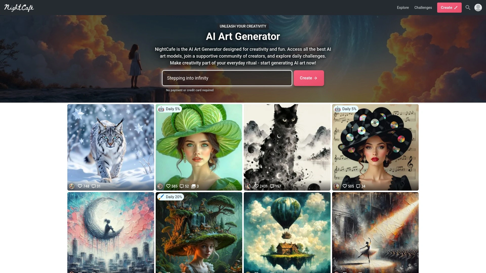

NightCafe aggregates multiple AI models into one interface—access Flux, Stable Diffusion, DALL-E 3, Ideogram, Google Imagen, plus video models like LUMA Dream Machine. This variety lets you compare outputs from different algorithms for the same prompt, choosing whichever interpretation works best. The older VQGAN+CLIP models available on NightCafe produce artistic styles difficult to achieve with newer diffusion models.

**Community features differentiate NightCafe from competitors:** Public gallery showcases user creations, daily challenges encourage experimentation, and social interactions help creators discover new techniques. Print service transforms digital creations into physical art with AI enhancement to print quality, manual cropping, and doorstep delivery.

The style transfer capabilities apply one image's aesthetic to another's content—upload a rough product sketch and a reference showing desired material finish, then blend them into polished renders. Mobile and web apps sync creations across devices, letting you generate on laptops and refine on tablets.

**Credit system:** Free daily credits enable casual use; subscriptions starting around $10/month provide more generations and priority processing. Full copyright ownership transfers to creators using licensed source materials. Best for hobbyists, artists exploring AI capabilities, and creators who value style variety over single-model mastery.

***

## **[Runway ML](https://runwayml.com)**

AI video and image editing suite focused on motion graphics and dynamic content creation.

Runway ML pioneered AI for video creators, offering tools that automatically remove backgrounds, apply color grading, track objects, and generate videos from text or image prompts. The Gen-2 text/image-to-video feature transforms static architectural renders into animated walkthroughs, product images into reveal sequences, or storyboards into motion tests. Camera motion controls adjust horizontal pan, vertical tilt, roll, and zoom to simulate professional cinematography.

**Advanced capabilities beyond basic generation:** The new ALF conversational editing lets you type natural language commands like "make this a night shot" or "add rain effects" and watch AI transform existing videos accordingly. Object removal eliminates unwanted elements from footage, style transfers apply artistic looks to video frames, and upscaling enhances resolution. Designers prototype animations, filmmakers test shot compositions, and marketers create social content—all accelerating timelines from weeks to hours.

Integration with Adobe Firefly creates powerful workflows—generate static scenes in Firefly, animate them in Runway, composite layers in After Effects. The collaborative features let teams work simultaneously on projects with version control.

**Subscription model:** Free tier includes limited generations for testing; paid plans start $12/month scaling to unlimited professional use. Best for video creators, motion designers, and brands producing dynamic content for social platforms and advertising campaigns.

***

## **[Visme AI Design Generator](https://visme.co/ai-design-generator)**

Business-focused platform generating complete presentations, documents, and infographics from prompts.

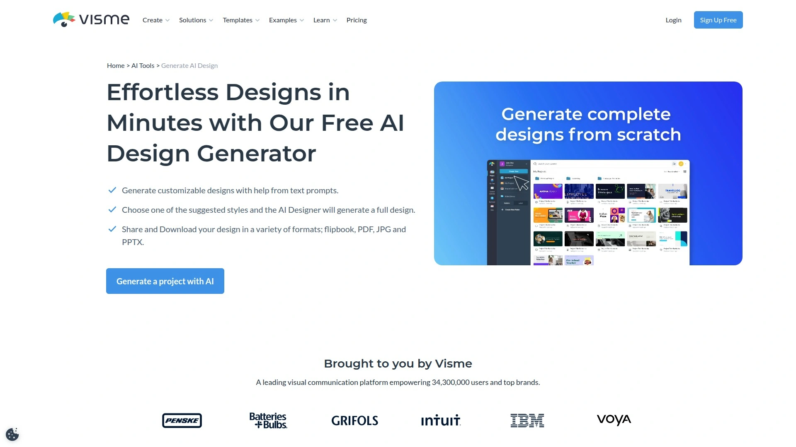

Visme takes AI beyond individual images, generating entire multi-page presentations, business documents, newsletters, and infographics from detailed prompts describing content and purpose. Type "develop a presentation showcasing medical devices revolutionizing patient care" and Visme's AI Designer creates 10-slide decks with relevant imagery, charts, layouts, and text within two minutes. The AI sources content from uploaded documents or website URLs you provide, ensuring generated designs contain your actual data rather than placeholder text.

**Design automation advantages:** Choose from suggested style options matching your project type—corporate reports look professional, marketing materials appear vibrant, educational content stays clear. Generated designs use your brand colors, fonts, and logos automatically when brand kits are set up through AI-powered Brand Wizard. No starting from blank canvases or scrolling through template libraries—describe what you need and get custom starting points.

The Visme editor provides full customization after generation—change color themes, swap images, adjust layouts, add videos or graphics from the royalty-free library, or generate new AI images directly within documents. Export completed projects as PDFs, JPGs, PPTX, or interactive flipbooks.

**Access pricing:** Free plan includes limited AI generations; premium plans scale for individuals and teams needing higher volume. Best for business professionals, consultants, and teams who produce presentations, reports, and visual documents regularly and want AI handling initial layouts.

***

## **[Planner 5D](https://planner5d.com)**

Specialized home and interior design software combining AI generation with manual editing tools.

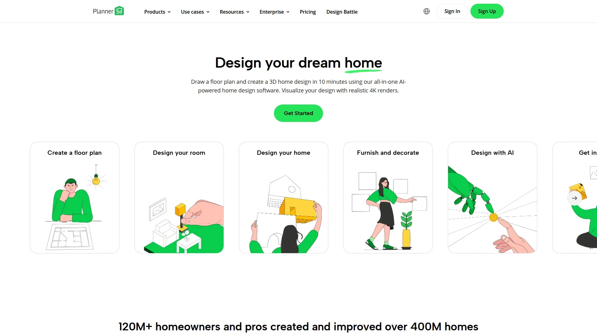

Planner 5D focuses exclusively on residential and interior design, offering AI-powered tools specifically for visualizing homes, rooms, and spaces rather than general images. The platform combines traditional 3D modeling with AI generation—manually draw floor plans with drag-and-drop walls, then let AI furnish rooms, suggest layouts, or generate HD renders showing photorealistic results. This hybrid approach gives control where you want it while accelerating tedious parts.

**AI interior design features:** Upload photos of existing rooms and AI redesigns them with different furniture styles, color schemes, or layouts. Start with empty floor plans and AI auto-furnishes based on room function and selected style preferences—modern, traditional, minimalist, industrial. Generate exterior designs and landscapes to visualize complete properties.

The extensive item library includes 120,000+ furniture pieces, materials, and decor elements from real brands, letting homeowners see how actual products look in their spaces before purchasing. Mobile apps for iOS and Android sync with web versions, so you design on computers and present on tablets when meeting clients.

**Subscription costs:** Free version includes basic features; premium unlocks HD rendering, additional items, and offline access. Best for homeowners planning renovations, real estate professionals staging properties, and interior designers presenting concepts to residential clients.

***

## **[Vizcom](https://vizcom.com)**

Product design tool transforming sketches into professional renders with 3D model generation.

Vizcom built specifically for product designers and industrial designers who sketch concepts and need them rendered for client presentations or development teams. The live render feature provides real-time feedback as you draw—start sketching a product and watch AI simultaneously generate polished renders matching your strokes. This immediate visual feedback accelerates iteration compared to drawing first, then waiting for batch rendering.

**Specialized workflows for product development:** Upload rough sketches, describe materials and colors in prompts, choose rendering styles from the palette library (Surface Sculpt for vehicle designs, Volume Render for form studies, Automotive Exterior/Interior for car concepts), and generate multiple visualization options. The influence slider adjusts how closely AI follows your original sketch versus taking creative liberty.

Advanced capabilities include 3D model generation from 2D renderings, creating rotatable models directly from flat images. Animation features add motion to show how concepts move and function. Custom AI model training creates private models understanding your company's specific aesthetic and design language.

**Access tiers:** Free version available with usage limits; professional accounts unlock teams, unlimited generations, and enhanced resolution. Best for product designers, automotive designers, and industrial design teams presenting concepts and developing physical products.

***

## **[Starryai](https://starryai.com)**

Free mobile-first AI art generator with full ownership rights and daily generation limits.

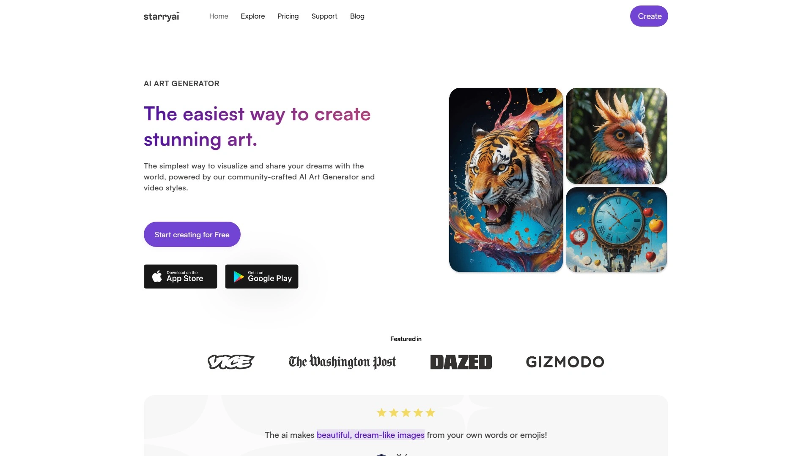

Starryai offers genuinely free AI image generation—create up to 25 images daily with no watermarks and keep full commercial ownership rights. The mobile-first approach means iOS and Android apps provide better experiences than web versions, perfect for creators generating social content on phones. Choose from four AI methods (Art, Photos, Illustrations, Custom Styles), select aesthetic preferences (CyberPunk, Portraits, Fantasy), and describe your vision through text prompts or the Prompt Builder tool.

**Style versatility serves diverse creative needs:** Animation, fantasy, steampunk, photography, and 3D art styles suit different projects. Style transfer applies one image's aesthetic to another's subject matter. The neural networks learn from user feedback, adapting outputs to match preferences over time.

Copyright ownership transfers completely to users who have rights to source materials, enabling commercial use in marketing campaigns, product packaging, book covers, or NFT creation. Creations save to your account under "My Creations" for future editing and variations.

**Pricing structure:** Completely free for 25 daily generations; Starryai Pro Unlimited removes limits and adds benefits like priority generation and all canvas sizes. Best for social media creators, illustrators, and small businesses needing regular AI art without subscription costs.

---

## **[Craiyon](https://craiyon.com)**

Accessible free AI art generator perfect for beginners exploring text-to-image creation.

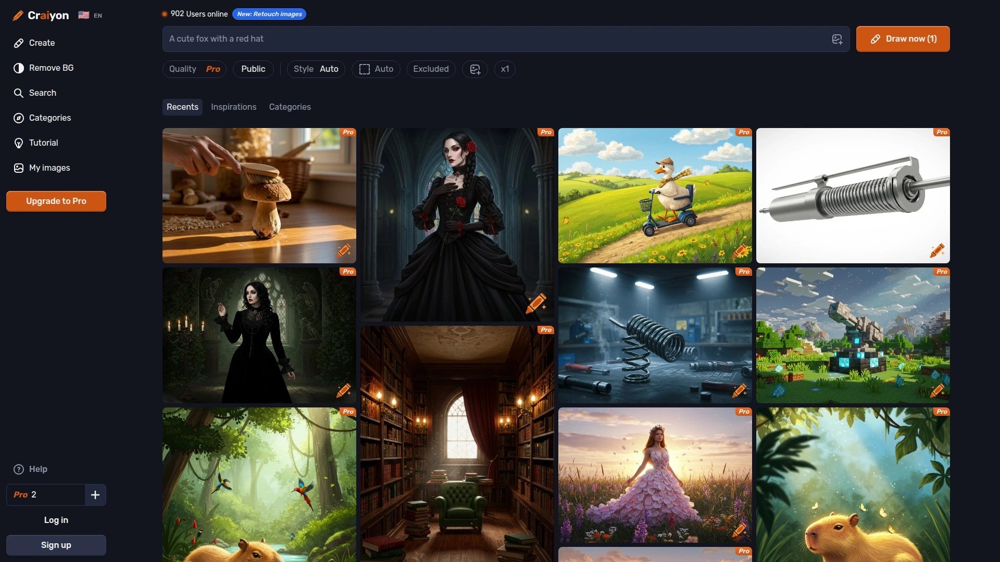

Craiyon (formerly DALL-E Mini) democratizes AI image generation with completely free access requiring no sign-up, subscriptions, or technical knowledge. Type a text description and receive nine image variations showing different interpretations of your prompt. The straightforward interface removes barriers for people intimidated by more complex platforms—students, hobbyists, and casual users generate images for school projects, social posts, or personal amusement.

Quality trades off against accessibility—Craiyon outputs show more artifacts and less polish than premium platforms, but serve perfectly for brainstorming, concept sketches, and casual content. The speed has improved since launch, with generations completing in seconds rather than minutes.

Style options include Art, Drawing, Photo, and None, adjusting aesthetic interpretation. Negative prompts exclude unwanted elements by specifying what not to include. The community gallery showcases popular creations and trending prompts, helping beginners learn effective description techniques.

**Cost model:** Completely free with ads; optional subscriptions remove ads and provide faster generation. Best for students, educators, hobbyists, and anyone wanting to experiment with AI image generation without financial commitment or complex learning curves.

***

## **[Designs.ai](https://designs.ai)**

Integrated suite combining AI logo design, image generation, video creation, and voiceover tools.

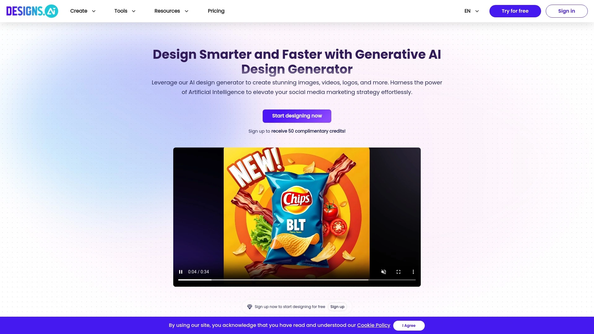

Designs.ai bundles multiple AI creative tools into unified subscriptions—generate logos, create images, produce videos, and add AI voiceovers without juggling separate platforms. The logomaker uses machine learning to design brand identities based on company names and industry selections. Image generator creates visuals matching brand guidelines automatically when logos and color schemes are set.

**Video creation tools leverage AI for automation:** Transform blog posts into video content, generate stock footage, add text animations, and synthesize voiceovers in multiple languages. Marketing teams produce social content, explainer videos, and ad variations quickly without video editing expertise.

The all-in-one approach suits small businesses and solopreneurs who need diverse content types but can't afford specialized software for each discipline. Chat interface provides AI assistance throughout the creation process.

**Subscription access:** Free tier available for testing; paid plans bundle all tools starting around $20/month for individuals. Best for small marketing teams, agencies serving multiple clients, and entrepreneurs building brands who need logos, images, and videos from one platform.

***

## FAQ

**Which AI image generator works best for architecture and interior design visualization?**
PromeAI leads specifically for design professionals because it trained on architectural and interior design datasets, producing accurate spatial layouts, appropriate materials, and proper lighting. Fotor and Planner 5D also target these verticals with specialized tools. For pure artistic concept exploration, Midjourney creates stunning architectural imagery with aesthetic coherence, though dimensions may not match engineering precision.

**Do free AI image generators provide sufficient quality for professional client presentations?**
Free tiers from platforms like Canva, Leonardo AI, and Starryai produce client-ready quality for initial concepts and internal reviews. However, professionals billing clients typically upgrade to paid plans for higher resolutions, no watermarks, and priority generation ensuring deadlines are met. Craiyon works for brainstorming but lacks polish for final deliverables.

**Can AI-generated images be used commercially without copyright issues?**
Ownership varies by platform—Adobe Firefly and Starryai explicitly transfer commercial rights to users. Midjourney grants commercial use with paid subscriptions. Always verify each platform's terms and ensure source materials uploaded as references don't infringe others' copyrights. Open-source Stable Diffusion allows commercial use but model training sources create gray areas legally.

---

## Conclusion

The right AI image generator depends on your creative workflow and output needs—product designers choose Vizcom for sketch rendering, marketers prefer Canva for template integration, and video creators rely on Runway for motion content. For design professionals across architecture, interior design, and product development who need industry-specific rendering quality with minimal learning curves, **[PromeAI](https://www.promeai.pro)** delivers the strongest combination of sketch-to-render accuracy, professional output quality, and workflow efficiency that transforms rough concepts into client-ready presentations in seconds rather than hours.
